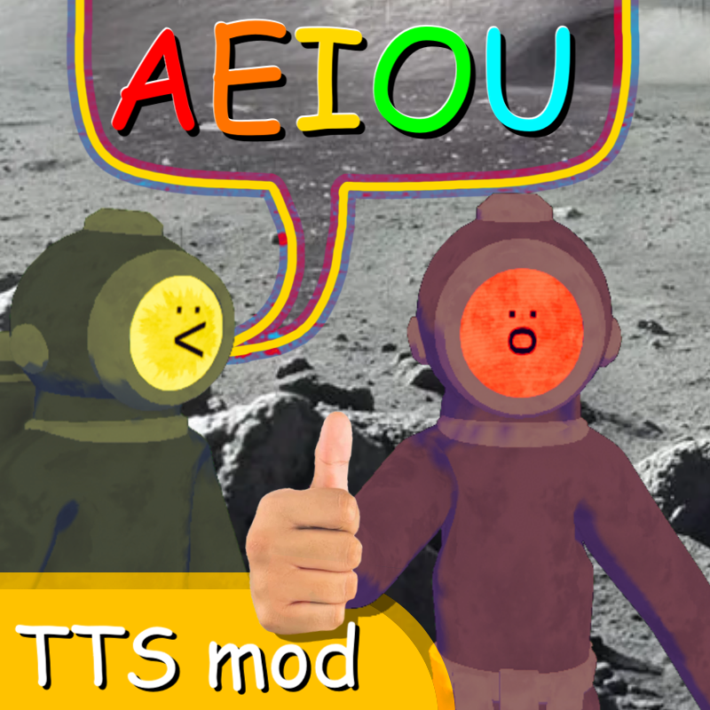

# AeiouContent

DECtalk text-to-speech in Content Warning.

## Install instructions

- Install the [SimpleChat](https://thunderstore.io/c/content-warning/p/maysunrise/SimpleChat/) mod.
- Go to the [Releases page](https://github.com/juanjp600/AeiouContent/releases) and download the latest version. The filename will be something along the lines of `juanjp600-AeiouCompany-*.zip`.
- Extract the downloaded file into its own folder in your `BepInEx/plugins` folder.

## Build instructions

- Get the latest version of [Visual Studio](https://visualstudio.microsoft.com/), or your .NET IDE of choice. You'll need at least .NET 8.
- Clone this repository, then set up the SharpTalk submodule with `git submodule init` followed by `git submodule update`.
- Go to where Content Warning is installed, and copy the contents of `Content Warning_Data/Managed` into `AeiouContent/Dependencies`.
- Copy `CWChat.dll` from SimpleChat into `AeiouContent/Dependencies`.
- Build `AeiouContent`.

## Special thanks
- ArbiterBibendi for creating [AEIOUCompany](https://github.com/ArbiterBibendi/AEIOUCompany/), which I used as a base to create this mod.
- maysunrise for creating [SimpleChat](https://thunderstore.io/c/content-warning/p/maysunrise/SimpleChat/), which this mod hooks into.
- [its_soupgirl](https://www.youtube.com/@its_soupgirl) for making the icon for this mod.